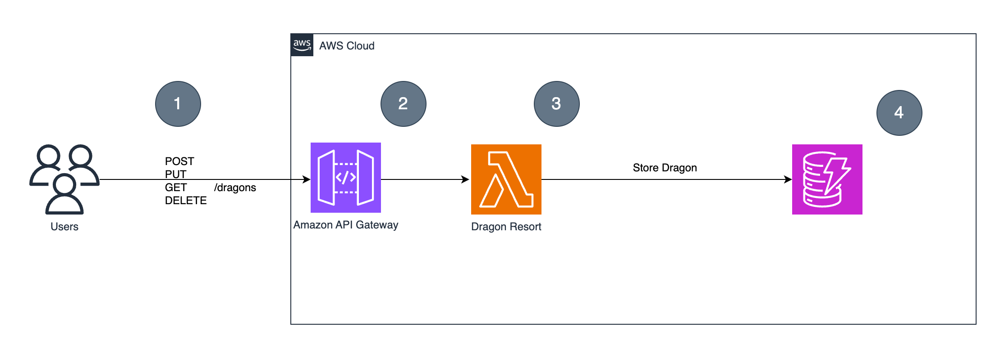
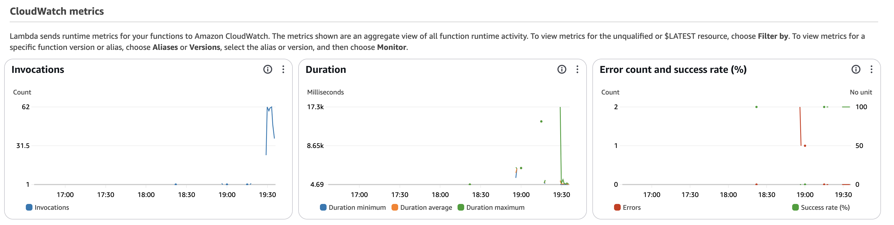
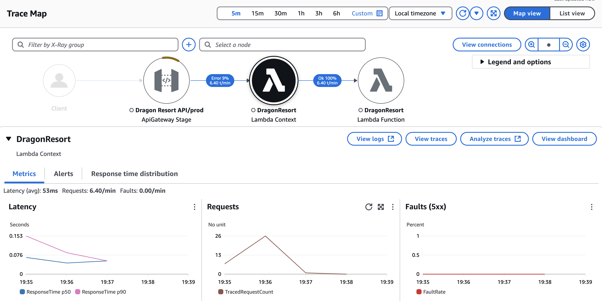
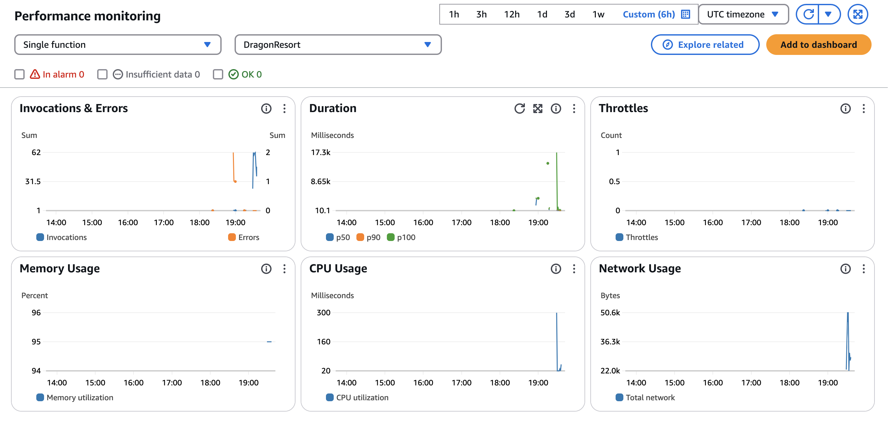

This is a serverless API for managing records stored in an Amazon DynamoDB table using AWS CDK for Infrastructure provisioning.

### Core AWS Services Used:
- Amazon DynamoDB
- AWS Lambda
- Amazon API Gateway

### Observability and Monitoring:
- AWS X-Ray
- CloudWatch 
- AWS Lambda Insights

### Architecture



I've provided a [curl](curl.sh) script if you need to test.

### Metrics

The [unleash dragons](infrastructure/events/unleash_dragons.sh) script simulates load tests for metrics by:
- Creating, reading, updating, and deleting records.
- Generating random data (name, type, age, color).
- Sending occasional invalid requests to test error handling.
- Running **100 requests per operation type** (create, list, get, delete).
- Helping visualize performance metrics and errors in **AWS X-Ray Traces**.


## Monitoring & Performance Insights
This API integrates with three core monitoring tools

#### **CloudWatch**

  


#### **X-Ray**



#### **Lambda Insights**




### Deploy to AWS

1. **Install AWS CDK:**
    ```sh
    npm install -g aws-cdk
    ```
2. **Bootstrap your AWS environment (if not already done):**
    ```sh
    cdk bootstrap
    ```
3. **Deploy the infrastructure:**
    ```sh
    cd infrastructure
    cdk deploy
    ```

4. **Delete the infrastructure:**
    ```sh
    cdk destroy
    ```
